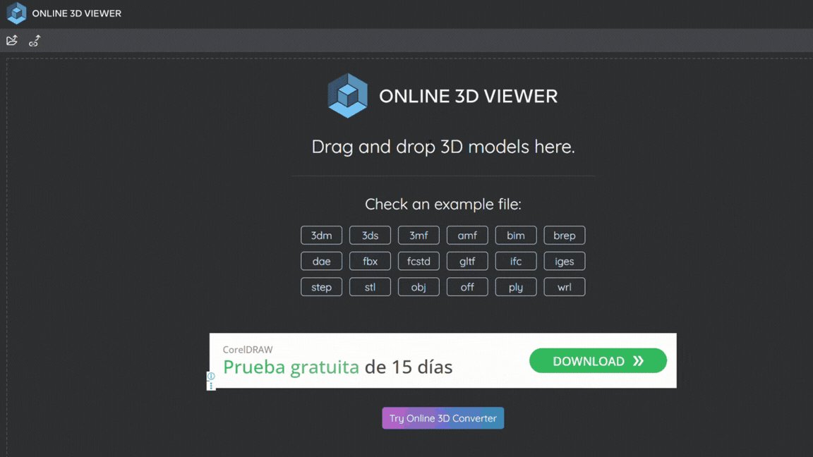

# Prácticas y proyectos de Modelado 3D con VRML

## Descripción
> Ejercicios prácticos para familiarizarse con el modelado 3D utilizando VRML (Virtual Reality Modeling Language), enfocados en la creación de escenarios y objetos tridimensionales para la web.
>
> Históricamente, estos archivos se integraban en páginas HTML utilizando etiquetas como <*embed src="modelo.wrl"*> o <*object*>, requiriendo visores o plugins dedicados en el navegador.
>
>  **Propósito del repositorio 🚀** : Este proyecto reúne prácticas y ejercicios almacenados durante mi etapa escolar (preparatoria). Lo comparto para documentar mi aprendizaje con diferentes lenguajes y mostrar cómo el estudio de tecnologías heredadas (legacy) ayuda a comprender los fundamentos de los gráficos 3D interactivos.
 
 

## Estado del repositorio 📊️

 
 

## Tecnologías utilizadas 🔨

 

### Notas importantes ⚠
  - VRML es una tecnología previa al estándar actual de la web 3D (como WebGL o Three.js). Por esta razón, el código se presenta tal cual fue desarrollado, sin comentarios extensos.
 
 

## Visualización y configuración 🚀
Para explorar los archivos en el navegador sin instalar software local, puedes utilizar un visor web compatible con formato *.wrl*, como [3D Viewer](!https://3dviewer.net/)

- Descarga de archivos: Descarga el archivo .wrl de tu interés. Si se trata de un proyecto con texturas, descarga el archivo ZIP completo que incluye las imágenes correspondientes.

- Carga en la plataforma:

(En el clip adjunto se muestra el proceso paso a paso desde el inicio usando un clip dedicado a 3D Viewer.)
  1. Al abrir el modelo, dirígete al icono "Files" en la barra lateral izquierda. Allí verás el archivo cargado y una lista de "elementos faltantes".
  2. Sube o arrastra las imágenes de textura (.jpg) respetando sus nombres originales para cargar el entorno completo con sus materiales.

  
 
 

## Soporte ⚙
Si tienes alguna pregunta, encuentras un error en alguno de los documentos o deseas sugerir una mejora, ¡no dudes en abrir un issue en este repositorio! Me encantaría recibir tus comentarios.

* ¿Encontraste un error? Abre un issue y describe el problema.
* ¿Tienes una sugerencia? Abre un issue y comparte tu idea.

Acercate a mis redes sociales para atender tus dudas y sugerencias en la sección de [Contacto](#contacto-)
 
 

## Licencia ✅
Se permite el uso, copia y distribución de este proyecto, siempre y cuando se mantenga la atribución original y no se sublicencie. No se permite su distribución, modificación o uso comercial sin permiso expreso del autor.

Copyright (c) 2026 at Odra Sanchez. Enlace del perfil:

  

 

## Contacto 🌐
Si tienes alguna pregunta o sugerencia, no dudes en contactarme:

  
 
 
 
 
 

