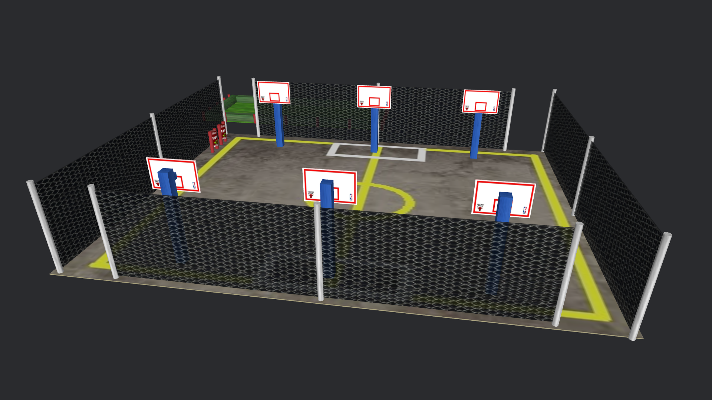
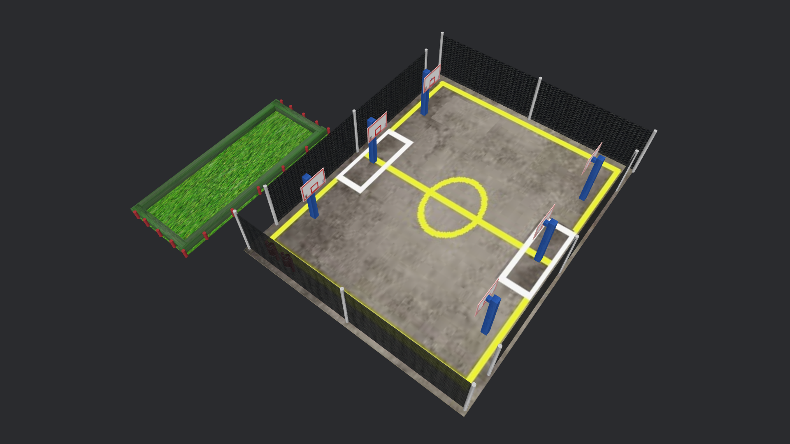
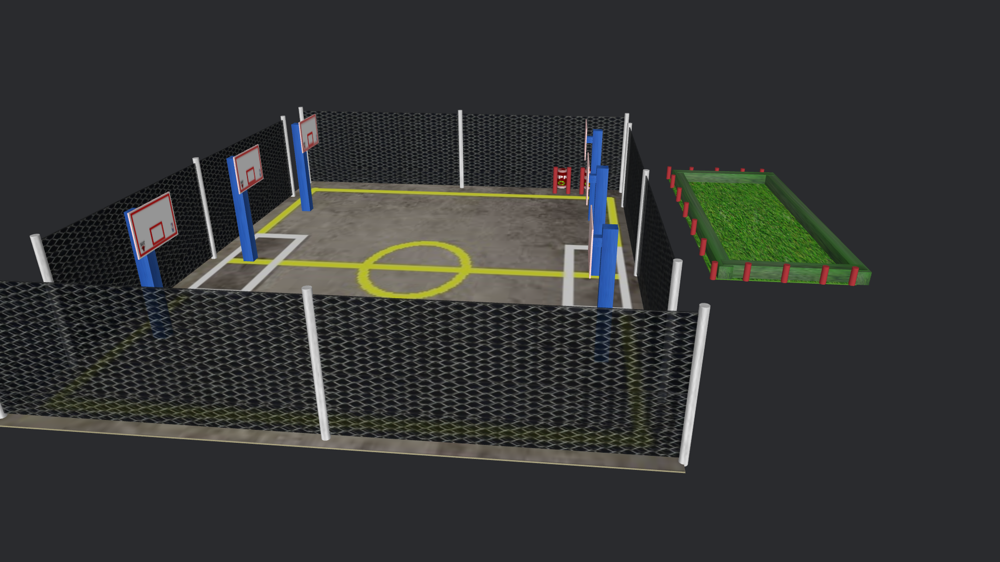

# Proyecto: Canchas de Basquetball CECyT No.3

## Descripción
> Recreación de un segmento del área de canchas del CECyT No.3 con figuras basicas y uso de paquetes de texturas.
>
> Elementos recreados:
> - Chancha con red ciclonica
> - Canastas
> - Botes de basura
> - Área verde divisora entre la cancha y edificio de aulas
 
 

## Visualización
<table border="0">
  <tbody>
    <tr>
      <td></td>
      <td></td>
      <td></td>
    </tr>
  </tbody>
</table>