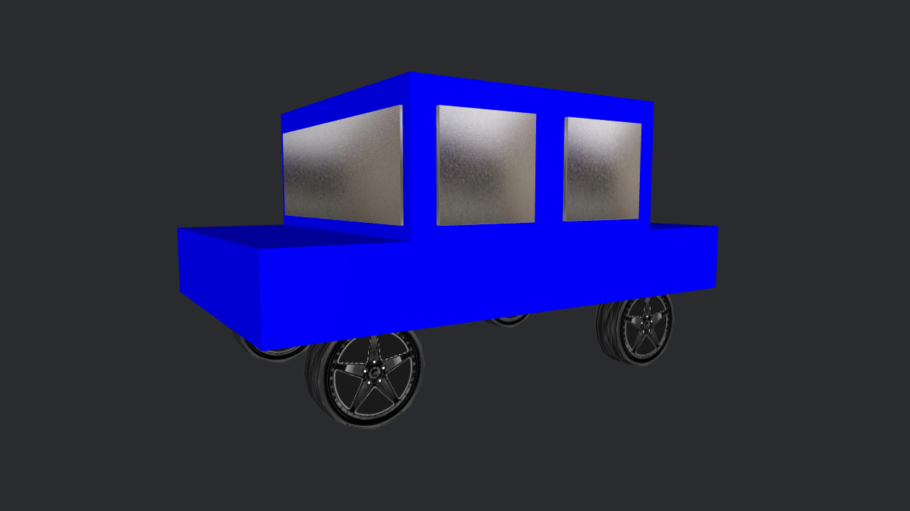
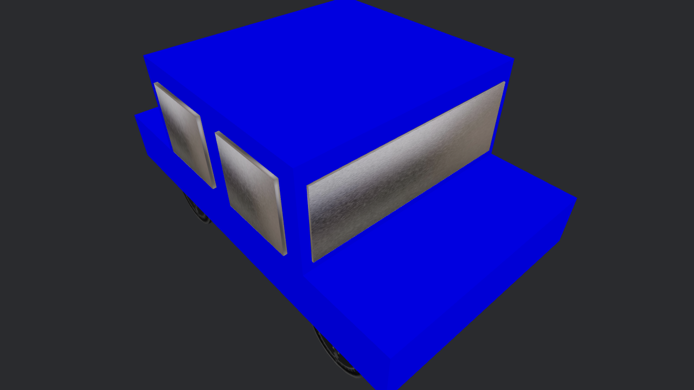
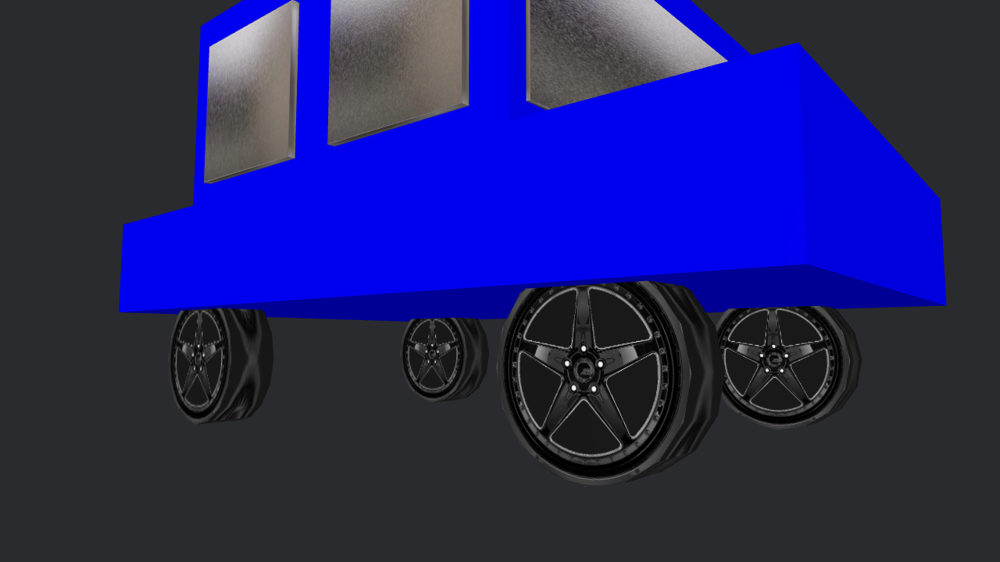

# Proyecto: Vehículo Azul

## Descripción
> Recreación de un vehículo con figuras básicas: Cajas y cilindros. Uso de paquete de texturas
 
 

## Visualización
<table border="0">
  <tbody>
    <tr>
      <td></td>
      <td></td>
      <td></td>
    </tr>
  </tbody>
</table>